> **Figure Description (llava:latest):**
> The image provided appears to be a QR code. QR codes are matrix barcodes that can be scanned with a smartphone camera to reveal hidden information such as URLs, contact details, or text. In this case, the QR code likely contains some form of encoded data that would be revealed upon scanning it. The context provided in the surrounding document mentions an Italian physicist named Galileo and references his observation that all material objects tend to fall towards the Earth. However, there is no direct connection between the QR code and this textual content visible from the image.

# 

# 

# 

Early in our lives, we become aware of the tendency of all material objects to be attracted towards the Earth. Anything thrown up falls down towards the earth, going uphill is lot more tiring than going downhill, raindrops from the clouds above fall towards the earth and there are many other such phenomena. Historically it was the Italian Physicist Galileo (1564-1642) who recognised the fact that all bodies, irrespective of their masses, are accelerated towards the earth with a constant acceleration. It is said that he made a public demonstration of this fact. To find the truth, he certainly did experiments with bodies rolling down inclined planes and arrived at a value of the acceleration due to gravity which is close to the more accurate value obtained later.

A seemingly unrelated phenomenon, observation of stars, planets and their motion has been the subject of attention in many countries since the earliest of times. Observations since early times recognised stars which appeared in the sky with positions unchanged year after year. The more interesting objects are the planets which seem to have regular motions against the background of stars. The earliest recorded model for planetary motions proposed by Ptolemy about 2000 years ago was a 'geocentric' model in which all celestial objects, stars, the Sun and the planets, all revolved around the Earth. The only motion that was thought to be possible for celestial objects was motion in a circle. Complicated schemes of motion were put forward by Ptolemy in order to describe the observed motion of the planets. The planets were described as moving in circles with the centre of the circles themselves moving in larger circles. Similar theories were also advanced by Indian astronomers some 400 years later. However a more elegant model in which the Sun was the centre around which the planets revolved – the 'heliocentric' model – was already mentioned by Aryabhatta (5th century A.D.) in his treatise. A thousand years later, a Polish monk named Nicolaus Copernicus (1473-1543)

| 7.1  | Introduction                                                     |
|------|------------------------------------------------------------------|
| 7.2  | Kepler's laws                                                    |
| 7.3  | Universal law of gravitation                                     |
| 7.4  | The gravitational constant                                       |
| 7.5  | Acceleration due to gravity of the earth                         |
| 7.6  | Acceleration due to gravity below and above the surface of earth |
| 7.7  | Gravitational potential energy                                   |
| 7.8  | Escape speed                                                     |
| 7.9  | Earth satellites                                                 |
| 7.10 | Energy of an orbiting satellite                                  |
|      | Summary                                                          |
|      | Points to ponder                                                 |
|      | Exercises                                                        |

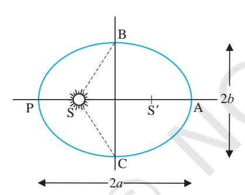

> **Figure Description (llava:latest):**
> The image depicts a mathematical diagram that represents an elliptical orbit of a celestial body around a central sun, similar to how planets like Earth orbit the Sun. This type of orbit is a part of Kepler's laws of planetary motion, which describes the relationship between the orbital period and the semi-major axis of an ellipse.
> 
> The diagram includes two circular orbits labeled as "Planet B" and "Planet S," indicating that these are the planets in question. The first planet is positioned on the left side of the image, while the second is on the right. Both planets are shown at different points within their respective orbits, which suggests a progression of time.
> 
> The central sun is located at the origin, with the planets' positions on an x-axis and y-axis forming a Cartesian coordinate system. The axes are labeled with "x" for the horizontal axis and "y" for the vertical axis. This representation allows one to visualize how the planets move around the Sun over time.
> 
> The relationship between the distance of the planets from the Sun (represented by the radius of their orbits) and the semi-major axis of the ellipse is illustrated by the two circles being drawn with their radii proportional to the semi-axis, as indicated by the scale at the bottom right.
> 
> In the context of the document, this diagram serves as a visual aid to explain Kepler's laws of planetary motion and the concept of escape speed in the context of satellites orbiting Earth. The reference to Tycho Brahe suggests that his observations were critical in the development of these theories.

proposed a definitive model in which the planets moved in circles around a fixed central Sun. His theory was discredited by the church, but notable amongst its supporters was Galileo who had to face prosecution from the state for his beliefs.

It was around the same time as Galileo, a nobleman called Tycho Brahe (1546-1601) hailing from Denmark, spent his entire lifetime recording observations of the planets with the naked eye. His compiled data were analysed later by his assistant Johannes Kepler (1571- 1640). He could extract from the data three elegant laws that now go by the name of Kepler's laws. These laws were known to Newton and enabled him to make a great scientific leap in proposing his universal law of gravitation.

# **7.2 KEPLER'S LAWS**

The three laws of Kepler can be stated as follows:

**1. Law of orbits :** All planets move in elliptical orbits with the Sun situated at one of the foci

**Fig. 7.1(a)** *An ellipse traced out by a planet around the sun. The closest point is P and the farthest point is A, P is called the perihelion and A the aphelion. The semimajor axis is half the distance AP.*

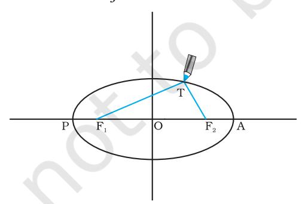

> **Figure Description (llava:latest):**
> The image shows a graphical representation of an ellipse with several labeled points. An ellipse is a closed curve that forms the shape of an oval or elongated circle with two focal points, one on each side of the minor axis. This particular illustration displays an elliptical orbit centered around a point that could be interpreted as the sun.
> 
> In the context provided by the surrounding document text, the image is used to explain Kepler's laws of planetary motion, specifically focusing on the first law: "All planets move in elliptical orbits with the Sun situated at one of the foci." The labeled points around the orbit represent various positions of a hypothetical planet as it moves along its elliptical path.
> 
> The text in the document refers to an ellipse, which is defined by two focal points and a string that keeps the pencil tip taut while the pencil is moved around the curve. The major and minor axes of the ellipse are also described as being tangent to the orbits of the planets at their aphelia (the furthest point from the center) and perihelia (the closest point), respectively.
> 
> The image, along with the accompanying text, serves as an educational tool to help readers visualize the first law mentioned in the document. It provides a clear representation of how planetary orbits can follow an elliptical path rather than being perfectly circular, which is counterintuitive according to the Copernican model. The text and image together explain that this deviation from circular orbits was proposed by Kepler as part of his laws of planetary motion, a significant step in understanding celestial mechanics.

**Fig. 7.1(b)** *Drawing an ellipse. A string has its ends fixed at F1 and F2 . The tip of a pencil holds the string taut and is moved around.*

of the ellipse (Fig. 7.1a). This law was a deviation from the Copernican model which allowed only circular orbits. The ellipse, of which the circle is a special case, is a closed curve which can be drawn very simply as follows.

Select two points F1 and F2 . Take a length of a string and fix its ends at F1 and F2 by pins. With the tip of a pencil stretch the string taut and then draw a curve by moving the pencil keeping the string taut throughout.(Fig. 7.1(b)) The closed curve you get is called an ellipse. Clearly for any point T on the ellipse, the sum of the distances from F1 and F2 is a constant. F1 , F2 are called the focii. Join the points F1and F2and extend the line to intersect the ellipse at points P and A as shown in Fig. 7.1(b). The midpoint of the line PA is the centre of the ellipse O and the length PO = AO is called the semi-major axis of the ellipse. For a circle, the two focii merge into one and the semi-major axis becomes the radius of the circle.

**2. Law of areas :** The line that joins any planet to the Sun sweeps equal areas in equal intervals of time (Fig. 7.2). This law comes from the observations that planets appear to move slower when they are farther from the Sun than when they are nearer.

> **Figure Description (llava:latest):**
> The image depicts a diagram illustrating the elliptical orbit of a planet around the Sun using a simple geometric representation. In this diagram, there is an ellipse with two foci (points where the plane of the orbit cuts the diameter), labeled as "A" and "B". One focus corresponds to perihelion, which is the closest point of the elliptical orbit to the Sun, and the other represents aphelion, which is the furthest point from the Sun.
> 
> The planet P is shown in a position that is approximately halfway between the perihelion (A) and the aphelion (B). This position suggests that the planet's distance from the Sun at this time is equal to the semi-major axis of its elliptical orbit, as mentioned in the document.
> 
> The diagram also includes a circular sector labeled "D", which appears to be swept out during a small interval of time (d*t), representing an area of space covered by the planet's path. This concept is related to the law of areas discussed in the document, where it mentions that for a planet, the line joining any planet to the Sun sweeps equal areas in equal intervals of time.
> 
> The document provides an example scenario with a planet's speed and the Sun-planet distance at perihelion and aphelion, as well as a question about the relationship between these quantities and whether the planet will take equal times to traverse two sections of its elliptical orbit (labeled BAC and CPB). The reader is expected to use this diagram and the text in the document to understand and analyze the example scenario.

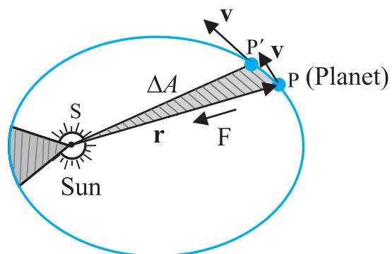

> **Figure Description (llava:latest):**
> This image is a combination of a scientific concept diagram and text that provides a mathematical explanation related to planetary motion. The diagram shows an elliptical orbit with two foci, labeled A and F. Inside the ellipse, there are arcs marked off as $BAC$ and $CPB$, which are likely meant to represent segments of the orbit traversed by a celestial body, such as a planet.
> 
> The text accompanying the diagram explains that the focus PA of an ellipse is the center O and the semi-major axis PO is the major diameter of the ellipse. The author also mentions that the Law of Areas implies that the areas swept out by a planet in equal intervals of time are equal, which is used to describe the observations that planets appear to move slower when they are farther from the Sun than when they are nearer.
> 
> An example problem (7.1) is given, where the reader is prompted to relate the distance $r_p$ and velocity $v_p$ at the perihelion with those at the aphelion for a planet orbiting the Sun. The question asks whether the planet will take equal times to traverse segments of its orbit, $BAC$ and $CPB$.
> 
> The image is intended to illustrate how planetary motion is described in terms of elliptical orbits, semi-major axes, focus points, and the relationship between distances from the Sun and speeds of a planet within its orbit. The context provided suggests that this diagram may be used in an educational setting, possibly in a physics, astronomy, or mathematics class to teach concepts related to celestial mechanics and orbital dynamics.

**Fig. 7.2** *The planet P moves around the sun in an elliptical orbit. The shaded area is the area* D*A swept out in a small interval of time* D*t.*

➔ *Example 7.1* Let the speed of the planet at the perihelion  $Pin$  Fig. 7.1(a) be  $v_p$  and the Sun-planet distance SP be  $r_p$ . Relate  $\{r_p, v_p\}$  to the corresponding quantities at the aphelion  $\{r_A, v_A\}$ . Will the planet take equal times to traverse  $BAC$  and  $CPB$ ?

**3. Law of periods** : The square of the time period of revolution of a planet is proportional to the cube of the semi-major axis of the ellipse traced out by the planet.

Table 7.1 gives the approximate time periods of revolution of eight\* planets around the Sun along with values of their semi-major axes.

Table 7.1 Data from measurement of planetary motions given below confirm Kepler's Law of Periods

| Planet  | a    | T     | Θ    |
|---------|------|-------|------|
| Mercury | 5.79 | 0.24  | 2.95 |
| Venus   | 10.8 | 0.615 | 3.00 |
| Earth   | 15.0 | 1     | 2.96 |
| Mars    | 22.8 | 1.88  | 2.98 |
| Jupiter | 77.8 | 11.9  | 3.01 |
| Saturn  | 143  | 29.5  | 2.98 |
| Uranus  | 287  | 84    | 2.98 |
| Neptune | 450  | 165   | 2.99 |

The law of areas can be understood as a consequence of conservation of angular momentum which is valid for any central force . A central force is such that the force on the planet is along the vector joining the Sun and the planet. Let the Sun be at the origin and let the position and momentum of the planet be denoted by  $\mathbf{r}$  and  $\mathbf{p}$  respectively. Then the area swept out by the planet of mass  $m$  in time interval  $\Delta t$  is (Fig. 7.2)  $\Delta\mathbf{A}$  given by

A ½ ×

$$\Delta \mathbf{A} / \Delta t = \frac{1}{2} (\mathbf{r} \times \mathbf{p})/m, \text{ (since } \mathbf{v} = \mathbf{p}/m\text{)} \\ = L / (2 m) \quad (7.2)$$

 × A

the law of areas. Gravitation is a central force and hence the law of areas follows.

**Answer** The magnitude of the angular momentum at  $P$  is  $L_p = m_p r_p v_p$ , since inspection tells us that  $r_p$  and  $v_p$  are mutually perpendicular. Similarly,  $L_A = m_p r_A v_A$ . From angular momentum conservation

$$m_p r_p V_p = m_p r_A V_A$$

or 
$$\frac{v_p}{v_A} = \frac{r_A}{r_p}$$

The area  $SBAC$  bounded by the ellipse and the radius vectors  $SB$  and  $SC$  is larger than  $SBPC$  in Fig. 7.1. From Kepler's second law, equal areas are swept in equal times. Hence the planet will take a longer time to traverse  $BAC$  than  $CPB$ .

# 

Legend has it that observing an apple falling from a tree, Newton was inspired to arrive at an universal law of gravitation that led to an explanation of terrestrial gravitation as well as of Kepler's laws. Newton's reasoning was that the moon revolving in an orbit of radius  $R_m$  was subject to a centripetal acceleration due to earth's gravity of magnitude

$$a_m = \frac{V^2}{R_m} = \frac{4\pi^2 R_m}{T^2} \quad (7.3)$$

*V RT* 2/ *m*

This clearly shows that the force due to earth's gravity decreases with distance. If one assumes that the gravitational force due to the earth decreases in proportion to the inverse square of the distance from the centre of the earth, we will have  $a_m \propto R_m^{-2}$ ;  $g \propto R_E^{-2}$  and we get

$$\frac{g}{a_m} = \frac{R_m^2}{R_E^2} \approx 3600 \quad (7.4)$$

in agreement with a value of  $g \approx 9.8 \text{ m s}^{-2}$  and the value of  $a_m$  from Eq. (7.3). These observations led Newton to propose the following Universal Law of Gravitation :

Every body in the universe attracts every other body with a force which is directly proportional to the product of their masses and inversely proportional to the square of the distance between them.

The quotation is essentially from Newton's famous treatise called 'Mathematical Principles of Natural Philosophy' (Principia for short).

Stated Mathematically, Newton's gravitation law reads : The force  $\mathbf{F}$  on a point mass  $m_2$  due to another point mass  $m_1$  has the magnitude

$$|\mathbf{F}| = G \frac{m_1 m_2}{r^2} \quad (7.5)$$

Equation (7.5) can be expressed in vector form as

$$\begin{aligned} \mathbf{F} &= G \frac{m_1 m_2}{r^2} (-\hat{\mathbf{r}}) = -G \frac{m_1 m_2}{r^2} \hat{\mathbf{r}} \\ &= -G \frac{m_1 m_2}{|\mathbf{r}|^3} \hat{\mathbf{r}} \end{aligned}$$

where G is the universal gravitational constant,  $\hat{\mathbf{r}}$  is the unit vector from  $m_1$  to  $m_2$  and  $\mathbf{r} = \mathbf{r}_2 - \mathbf{r}_1$  as shown in Fig. 7.3.

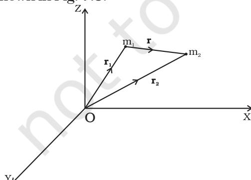

> **Figure Description (llava:latest):**
> The image displays a schematic of two bodies, labeled as point masses 1 and 2, which are interacting under the influence of gravity. The gravitational force between these two bodies is depicted by arrows indicating the direction of the force, which points from mass 1 to mass 2 due to Newton's third law of motion.
> 
> In the surrounding document text, there is a mathematical equation given by (7.5) that represents the gravitational force between the two masses. This equation includes the constant G, the product of the two masses m_1 and m_2, and the squared inverse of the distance r between the centers of the masses. The equation is provided in both scalar form and vector form.
> 
> The vector form of the equation defines the gravitational force as a vector quantity, with its magnitude equal to the product of G, the two masses, and the square of the reciprocal of the distance r, multiplied by the unit vector ∣r̂∣3 from mass 1 to mass 2. This representation shows that the gravitational force is a directed force that acts along the line connecting the two masses, with its direction being opposite to the line itself due to the attractive nature of gravity.
> 
> Overall, the image and text together provide a clear understanding of the gravitational interaction between the two masses, demonstrating how this force changes in magnitude and direction as the masses are moved closer or farther apart.

**Fig. 7.3** Gravitational force on  $m_1$  due to  $m_2$  is along  $\mathbf{r}$  where the vector  $\mathbf{r}$  is  $(\mathbf{r}_2 - \mathbf{r}_1)$ .

The gravitational force is attractive, i.e., the force  $\mathbf{F}$  is along  $-\mathbf{r}$ . The force on point mass  $m_1$  due to  $m_2$  is of course  $-\mathbf{F}$  by Newton's third law. Thus, the gravitational force  $\mathbf{F}_{12}$  on the body 1 due to 2 and  $\mathbf{F}_{21}$  on the body 2 due to 1 are related as  $\mathbf{F}_{12} = -\mathbf{F}_{21}$ .

Before we can apply Eq. (7.5) to objects under consideration, we have to be careful since the law refers to **point** masses whereas we deal with extended objects which have finite size. If we have a collection of point masses, the force on any one of them is the vector sum of the gravitational forces exerted by the other point masses as shown in Fig 7.4.

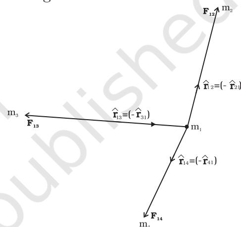

> **Figure Description (llava:latest):**
> The image appears to be a schematic representation of gravitational forces exerted between masses in a particular configuration, which is depicted as an equilateral triangle ABC with three equal masses at each vertex. The figure shows arrows indicating the direction and magnitude of the gravitational force vectors on one of the masses, labeled as "1." These force vectors are directed towards each of the other masses (2, 3, and 4), which are also represented by labels and arrows indicating their respective directions and magnitudes.
> 
> The surrounding document text discusses a scenario involving point masses, where the gravitational forces between them are described as acting along the lines connecting the masses, proportional to the product of the masses and inversely proportional to the square of the distance between them (as dictated by Newton's law of universal gravitation). This is visually represented by the arrows in the image.
> 
> The text also provides an equation (Eq. 7.5) for calculating the gravitational force vector on a point mass due to other point masses, which is formulated based on the inverse-square distance dependence and the product of the masses. This mathematical relationship is visually demonstrated through the arrows and their corresponding lengths and directions in the image.
> 
> The main components shown in the figure are the gravitational force vectors (denoted as $\mathbf{F}_{21}, \mathbf{F}_{31}$, and $\mathbf{F}_{41}$) on mass 1, which represent the attraction between mass 1 and the other masses at vertices 2, 3, and 4. The arrows show the direction of the gravitational force and their relative magnitudes, illustrating that each force is directed towards its corresponding mass.
> 
> The image serves as a visual aid to understand how the gravitational forces between point masses work in practice, providing a clear representation of the concept explained in the accompanying document text.

**Fig. 7.4** Gravitational force on point mass  $m_1$  is the vector sum of the gravitational forces exerted by  $m_2$ ,  $m_3$  and  $m_4$ .

The total force on  $m_1$  is

$$\mathbf{F}_1 = \frac{Gm_2 m_1}{r_{21}^2} \hat{\mathbf{r}}_{21} + \frac{Gm_3 m_1}{r_{31}^2} \hat{\mathbf{r}}_{31} + \frac{Gm_4 m_1}{r_{41}^2} \hat{\mathbf{r}}_{41}$$

**Example 7.2** Three equal masses of  $m$  kg each are fixed at the vertices of an equilateral triangle ABC.

- (a) What is the force acting on a mass  $2m$  placed at the centroid G of the triangle?
- (b) What is the force if the mass at the vertex A is doubled?

Take AG = BG = CG = 1 m (see Fig. 7.5)

**Answer** (a) The angle between GC and the positive x-axis is  $30^\circ$  and so is the angle between GB and the negative x-axis. The individual forces in vector notation are

cases, a simple law results when you do that :

(1) **The force of attraction between a hollow spherical shell of uniform density and a point mass situated outside is just as if the entire mass of the shell is**

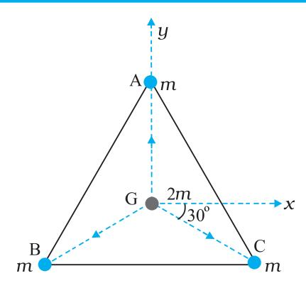

> **Figure Description (llava:latest):**
> The image you've provided appears to be a diagram related to a physics problem involving forces acting on an object in a three-dimensional space. The diagram shows a triangular prism with three vertices labeled A, B, and C. At each vertex, there is a force indicated by an arrow pointing away from the vertex, representing an attraction between the mass at that vertex and another point outside the triangle.
> 
> The forces are labeled as F_AB, F_BC, and F_CA, indicating that they are the forces acting on the vertices A, B, and C, respectively. These forces are represented by vectors with their magnitudes given in Newton (N), suggesting that these forces are significant enough to require measurement units.
> 
> The diagram also includes a representation of a coordinate system with an x-axis and a y-axis, indicating that this is a two-dimensional plane projected onto the three-dimensional space. The forces are not along the axes but rather at angles that can be calculated from the problem statement.
> 
> There's a numerical value provided next to vertex B: 2 N. This indicates the magnitude of the force acting on point B in the context of the question posed by the surrounding document text.
> 
> The surrounding document context suggests that this is part of a physics problem asking about forces, specifically how the forces act in this scenario and how they change if the mass at one of the vertices is doubled. The problem involves a simple law related to gravity where the force of attraction between two masses varies with the inverse square of their distance apart.

**concentrated at the centre of the shell.** Qualitatively this can be understood as follows: Gravitational forces caused by the various regions of the shell have components along the line joining the point mass to the centre as well as along a direction perpendicular to this line. The components perpendicular to this line cancel out when summing over all regions of the shell leaving only a resultant force along the line joining the point to the centre. The magnitude of this force works out to be as stated above.

(2) **The force of attraction due to a hollow spherical shell of uniform density, on a point mass situated inside it is zero.**

Qualitatively, we can again understand this result. Various regions of the spherical shell attract the point mass inside it in various directions. These forces cancel each other completely.

# **7.4 THE GRAVITATIONAL CONSTANT**

The value of the gravitational constant G entering the Universal law of gravitation can be determined experimentally and this was first done by English scientist Henry Cavendish in 1798. The apparatus used by him is schematically shown in Fig.7.6

**Fig. 7.6** *Schematic drawing of Cavendish's experiment. S1 and S2 are large spheres which are kept on either side (shown shades) of the masses at A and B. When the big spheres are taken to the other side of the masses (shown by dotted circles), the bar AB rotates a little since the torque reverses direction. The angle of rotation can be measured experimentally.*

**Fig. 7.5** *Three equal masses are placed at the three vertices of the* D *ABC. A mass 2m is placed at the centroid G*.

$$\mathbf{F}_{\text{GA}} = \frac{Gm(2m)}{1} \hat{\mathbf{j}} \quad (2)$$

$$\mathbf{F}_{\text{GB}} = \frac{Gm(2m)}{1} \left( -\hat{\mathbf{i}} \cos 30^\circ - \hat{\mathbf{j}} \sin 30^\circ \right)$$

$$\mathbf{F}_{\text{GC}} = \frac{Gm(2m)}{1} \left( +\hat{\mathbf{i}} \cos 30^\circ - \hat{\mathbf{j}} \sin 30^\circ \right)$$

From the principle of superposition and the law of vector addition, the resultant gravitational force **F**R on (2*m*) is

$$\mathbf{F}_R = \mathbf{F}_{GA} + \mathbf{F}_{GB} + \mathbf{F}_{GC}$$

$$\begin{aligned} \mathbf{F}_R = & 2Gm^2 \hat{\mathbf{j}} + 2Gm^2 (-\hat{\mathbf{i}} \cos 30^\circ - \hat{\mathbf{j}} \sin 30^\circ) \\ & + 2Gm^2 (\hat{\mathbf{i}} \cos 30^\circ - \hat{\mathbf{j}} \sin 30^\circ) = 0 \end{aligned}$$

Alternatively, one expects on the basis of symmetry that the resultant force ought to be zero.

(b) Now if the mass at vertex A is doubled then

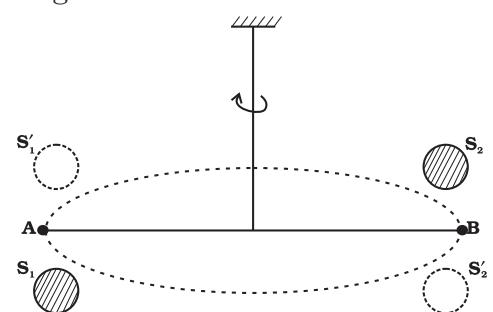

> **Figure Description (llava:latest):**
> The image displays an illustration of a gravitational force between two bodies, labeled A and B. Body A appears to be closer to the viewer, while body B is farther away, both aligned with each other along a vertical axis and positioned on either side of this line.
> 
> At the bottom of the illustration, there are annotations related to the gravitational force (F) between bodies A and B. The text suggests that this force can be calculated by considering the gravitational force exerted by body A on body B and the gravitational force exerted by body B on body A, which are then added together due to symmetry.
> 
> The calculation of the gravitational force (F) is provided in the equation given by F = 2GMm^2 hat_j. Here, G is a universal gravitational constant, M and m represent the masses of bodies A and B respectively, and hat_j denotes the unit vector in the vertical direction.
> 
> The annotation also includes a statement that for the gravitational force between an extended object (like Earth) and a point mass, the equation provided in this image is not directly applicable. Each point mass within the extended object exerts a gravitational force on the given point mass, but these forces will not add up to zero as suggested by symmetry because they are not all directed towards the same point.
> 
> The text implies that the reader should expect the resultant force (F_R) to be zero due to symmetry, but the annotations and the equation for F suggest that this is incorrect in the context of an extended object rather than two isolated masses. The illustration provides a visual representation of how gravitational forces might vary depending on the mass distribution and distance between the two bodies involved in the calculation.

$$F'_{GA} = \frac{G2m.2m}{1} \hat{j} = 4Gm^2 \hat{j}$$

$$\mathbf{F}'_{GB} = \mathbf{F}_{GB} \quad \text{and} \quad \mathbf{F}'_{GC} = \mathbf{F}_{GC}$$

$$\mathbf{F}'_R = \mathbf{F}'_{GA} + \mathbf{F}'_{GB} + \mathbf{F}'_{GC}$$

$$F'_R = 2 G m^2 \hat{j}$$

⊳

For the gravitational force between an extended object (like the earth) and a point mass, Eq. (7.5) is not directly applicable. Each point mass in the extended object will exert a force on the given point mass and these force will not all be in the same direction. We have to add up these forces vectorially for all the point masses in the extended object to get the total force. This is easily done using calculus. For two special

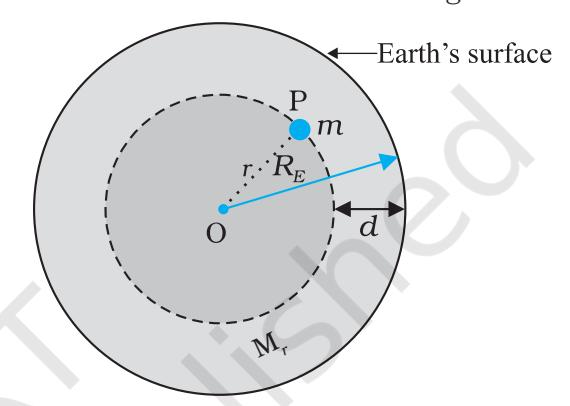

> **Figure Description (llava:latest):**
> The image depicts an illustration of a situation involving gravitational forces acting between a spherical object and smaller objects that are attached to a bar in a specific arrangement.
> 
> In the diagram:
> - There is a large, spherical object, which is presumably the Earth due to its shape and the presence of smaller objects.
> - Attached to a central point on the surface of this sphere are two small lead spheres. The central point could be the center of mass or gravity for the larger sphere.
> - A bar AB connects these two small spheres, forming a straight line that bisects their centers.
> - There is also a fine wire attached to each of the small spheres. This suggests that there are additional forces acting along this wire due to the interaction between the smaller spheres and the larger sphere or the Earth's surface.
> - Two large lead spheres are positioned on opposite sides of the small spheres, with one sphere being nearer to the small spheres than the other. These large spheres seem to be exerting an attractive force on the small spheres.
> - The text in the image suggests that there is no net force acting on the bar due to the gravitational forces between the small spheres and the larger spheres, but only a torque. This implies that the gravitational forces are causing a rotational motion around the central point of the large sphere.
> 
> The surrounding document context provides mathematical equations related to gravitational force and torque. The equation labeled as (7.5) is used for the gravitational force between an extended object and a point mass, but in this case, it's not directly applicable because there are multiple small objects attached to a bar that create forces with different directions and magnitudes.
> 
> Overall, the image appears to be a simplified representation of a complex mechanical system, possibly related to physics or engineering, where the gravitational force between objects is the central focus. The document context suggests that this could be part of an educational material or research paper discussing how gravity affects extended objects and the forces acting on them.

The bar AB has two small lead spheres attached at its ends. The bar is suspended from a rigid support by a fine wire. Two large lead spheres are brought close to the small ones but on opposite sides as shown. The big spheres attract the nearby small ones by equal and opposite force as shown. There is no net force on the bar but only a torque which is clearly equal to F times the length of the bar,where F is the force of attraction between a big sphere and its neighbouring small sphere. Due to this torque, the suspended wire gets twisted till such time as the restoring torque of the wire equals the gravitational torque . If θ is the angle of twist of the suspended wire, the restoring torque is proportional to θ, equal to τθ. Where ° is the restoring couple per unit angle of twist. ° can be measured independently e.g. by applying a known torque and measuring the angle of twist. The gravitational force between the spherical balls is the same as if their masses are concentrated at their centres. Thus if d is the separation between the centres of the big and its neighbouring small ball, M and m their masses, the gravitational force between the big sphere and its neighouring small ball is.

$$F = G \frac{Mm}{d^2} \quad (7.6)$$

If L is the length of the bar AB , then the torque arising out of *F* is *F* multiplied by L. At equilibrium, this is equal to the restoring torque and hence

$$G \frac{Mm}{d^2} L = \tau \, \theta \quad (7.7)$$

Observation of θ thus enables one to calculate *G* from this equation.

Since Cavendish's experiment, the measurement of *G* has been refined and the currently accepted value is

*G* = 6.67×10-11 N m2/kg2 (7.8)

# 7.5 ACCELERATION DUE TO GRAVITY OF THE EARTH

The earth can be imagined to be a sphere made of a large number of concentric spherical shells with the smallest one at the centre and the largest one at its surface. A point outside the earth is obviously outside all the shells. Thus, all the shells exert a gravitational force at the point outside just as if their masses are concentrated at their common centre according to the result stated in section 7.3. The total mass of all the shells combined is just the mass of the earth. Hence, at a point outside the earth, the gravitational force is just as if its entire mass of the earth is concentrated at its centre.

For a point inside the earth, the situation is different. This is illustrated in Fig. 7.7.

*Fig. 7.7 The mass m is in a mine located at a depth d below the surface of the Earth of mass ME and radius RE. We treat the Earth to be spherically symmetric.*

Again consider the earth to be made up of concentric shells as before and a point mass *m* situated at a distance *r* from the centre. The point P lies outside the sphere of radius *r*. For the shells of radius greater than *r*, the point P lies inside. Hence according to result stated in the last section, they exert no gravitational force on mass *m* kept at P. The shells with radius ≤ *r* make up a sphere of radius r for which the point P lies on the surface. This smaller sphere therefore exerts a force on a mass *m* at P as if its mass *Mr* is concentrated at the centre. Thus the force on the mass *m* at P has a magnitude

$$F = \frac{Gm (M_r)}{r^2} \quad (7.9)$$

We assume that the entire earth is of uniform

density and hence its mass is 3 E 4 3 *MRE* π = ρ where *ME* is the mass of the earth *RE* is its radius and ρ is the density. On the other hand the mass of the sphere *Mr* of radius *r* is 4 3 3 *r* π ρ and hence

$$F = Gm \left( \frac{4p}{3} r \right) \frac{r^3}{r^2} = Gm \left( \frac{M_E}{R_E^3} \right) \frac{r^3}{r^2} \\ = \frac{Gm M_E}{R_E^3} r \quad (7.10)$$

*E* If the mass m is situated on the surface of earth, then *r* = *RE* and the gravitational force on it is, from Eq. (7.10)

$$M = G \frac{M_E m}{R_E^2} \quad (7.11)$$

The acceleration experienced by the mass m, which is usually denoted by the symbol *g* is related to F by Newton's 2nd law by relation *F* = *mg*. Thus

$$g = \frac{F}{m} = \frac{GM_E}{R_E^2} \quad (7.12)$$

Acceleration *g* is readily measurable. *RE* is a known quantity. The measurement of *G* by Cavendish's experiment (or otherwise), combined with knowledge of *g* and *RE* enables one to estimate *ME* from Eq. (7.12). This is the reason why there is a popular statement regarding Cavendish : "Cavendish weighed the earth".

### 7.6 ACCELERATION DUE TO GRAVITY BELOW AND ABOVE THE SURFACE OF EARTH

Consider a point mass *m* at a height *h* above the surface of the earth as shown in Fig. 7.8(a). The radius of the earth is denoted by *RE .* Since this point is outside the earth,

*Fig. 7.8 (a) g at a height h above the surface of the earth.*

its distance from the centre of the earth is (*RE + h* ). If *F* (*h*) denoted the magnitude of the force on the point mass *m* , we get from Eq. (7.5) :

$$F(h) = \frac{GM_E m}{(R_E + h)^2} \quad (7.13)$$

The acceleration experienced by the point mass is *Fh m gh* ( )/ ( ) ≡ and we get

$$g(h) = \frac{F(h)}{m} = \frac{GM_E}{(R_E + h)^2}. \quad (7.14)$$

This is clearly less than the value of g on the surface of earth : 2 . *E E GM g R* = For , *hR* << *E* we can expand the RHS of Eq. (7.14) :

$$g(h) = \frac{GM_E}{R_E^2(1+h/R_E)^2} = g(1+h/R_E)^{-2}$$
For  $\frac{h}{R_E} \ll 1$ , using binomial expression,
$$g(h) \cong g\left(1 - \frac{2h}{R_E}\right). \quad (7.15)$$

Equation (7.15) thus tells us that for small heights h above the value of g decreases by a factor (1 2 / ). − *hRE*

Now, consider a point mass *m* at a depth *d* below the surface of the earth (Fig. 7.8(b)), so that its distance from the centre of the earth is () *Rd E* − as shown in the figure. The earth can be thought of as being composed of a smaller sphere of radius (*RE* – *d* ) and a spherical shell of thickness *d*. The force on m due to the outer shell of thickness d is zero because the result quoted in the previous section. As far as the smaller sphere of radius ( *RE* – *d* ) is concerned, the point mass is outside it and hence according to the result quoted earlier, the force due to this smaller sphere is just as if the entire mass of the smaller sphere is concentrated at the centre. If *Ms* is the mass of the smaller sphere, then,

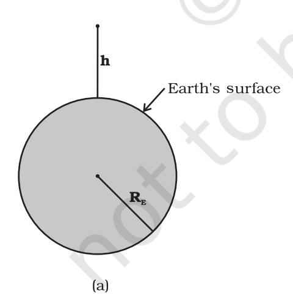

> **Figure Description (llava:latest):**
> The image depicts a spherical shell of thickness d and a smaller sphere within it, both centered around a point mass m. The shell is shown in a top-down view, with a line indicating a depth below the surface.
> 
> The surrounding document text provides mathematical equations related to gravitational forces exerted by these spheres on the point mass. The equations involve the mass of the smaller sphere (Ms) and its radius (RE - d), which is smaller than that of the larger shell (RE).
> 
> Equation (7.16) relates the force exerted due to the outer shell (R_E) and the spherical shell of thickness d, stating that it is as if all the mass in this shell is concentrated at the center. The equation also mentions a result in the previous section but does not detail its content within the context provided.
> 
> Equation (7.18) specifies the force on m due to the smaller sphere of radius (RE - d). This force is described as being inversely proportional to the square of the distance from the center, following Newton's law of universal gravitation. The acceleration resulting from this force, according to the given equation, would be proportional to both the mass of the larger shell and the mass of the smaller sphere, as well as inversely proportion to the cube of the radius difference (RE - d).
> 
> The text below Equation (7.18) indicates a substitution for Ms from an earlier equation, but it does not provide the full substitution or context for its use.

$$M_s/M_E = (R_E - d)^3 / R_E^3 \quad (7.16)$$

Since mass of a sphere is proportional to be cube of its radius.

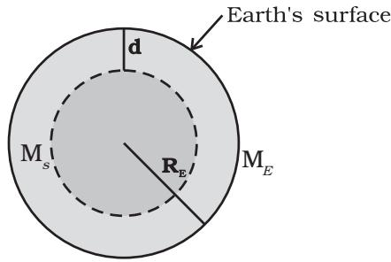

> **Figure Description (llava:latest):**
> The image appears to be a visual aid from a scientific document or textbook that is discussing the concept of gravity in the context of spheres. There are two diagrams labeled (a) and (b).
> 
> (a) features a larger sphere with radius \( R_E \), which represents Earth, and within it, there's a smaller sphere with radius \( d \). The smaller sphere is shaded to represent its mass distribution or perhaps its surface area. A point mass is shown outside the larger sphere, suggesting that this mass experiences a gravitational force due to the mass inside the larger sphere.
> 
> (b) is similar in appearance but focuses on the smaller sphere only. It illustrates that the force experienced by the point mass would be the same as if all the mass of the smaller sphere were concentrated at its center, emphasizing the proportional relationship between the mass and the radius of the sphere in determining gravity.
> 
> The accompanying text in the document context provides a result equation (7.16) that relates the force due to a spherical mass distribution to the distance from the center of the sphere. It also explains that the mass of a sphere is proportional to its radius cubed, and it presents two equations: one for the force due to the gravitational field in the larger sphere (7.17) and another for the acceleration due to gravity at a depth within the smaller sphere (7.18).
> 
> The image is likely used as an educational tool to help students understand how to calculate the gravitational force on a point mass due to the mass distribution inside a spherical body, such as Earth, considering both the larger and smaller spheres as well as the position of the point mass within these spheres. The equations are essential for understanding the gravitational forces between masses, as they provide the theoretical framework to calculate these effects in different scenarios.

(b) *Fig. 7.8 (b)* gat a depth  $d$ . In this case only the smaller sphere of radius  $(R_E - d)$  contributes to  $g$ . Thus the force on the point mass is

$$F(d) = G M_s m / (R_E - d)^2 \quad (7.17)$$

Substituting for  $M_s$  from above, we get

$$F(d) = G M_E m (R_E - d) / R_E^3 \quad (7.18)$$

and hence the acceleration due to gravity at a depth  $d$ ,

$$\begin{aligned} g(d) &= \frac{F(d)}{m} \text{ is} \\ g(d) &= \frac{F(d)}{m} = \frac{GM_E}{R_E^3} (R_E - d) \\ &= g \frac{R_E - d}{R_E} = g(1 - d/R_E) \end{aligned} \quad (7.19)$$

Thus, as we go down below earth's surface, the acceleration due gravity decreases by a factor  $(1 - d/R_E)$ . The remarkable thing about acceleration due to earth's gravity is that it is maximum on its surface decreasing whether you go up or down.

**7.7 GRAVITATIONAL POTENTIAL ENERGY**

We had discussed earlier the notion of potential energy as being the energy stored in the body at its given position. If the position of the particle changes on account of forces acting on it, then the change in its potential energy is just the amount of work done on the body by the force. As we had discussed earlier, forces for which the work done is independent of the path are the conservative forces.

The force of gravity is a conservative force and we can calculate the potential energy of a body arising out of this force, called the gravitational potential energy. Consider points

close to the surface of earth, at distances from the surface much smaller than the radius of the earth. In such cases, the force of gravity is practically a constant equal to  $mg$ , directed towards the centre of the earth. If we consider a point at a height  $h_1$  from the surface of the earth and another point vertically above it at a height  $h_2$  from the surface, the work done in lifting the particle of mass  $m$  from the first to the second position is denoted by  $W_{12}$ 

$$\begin{aligned} W_{12} &= \text{Force} \times \text{displacement} \\ &= mg(h_2 - h_1) \end{aligned} \quad (7.20)$$

If we associate a potential energy  $W(h)$  at a point at a height  $h$  above the surface such that

$$W(h) = mgh + W_0 \quad (7.21)$$

(where  $W_0$  = constant); then it is clear that

$$W_{12} = W(h_2) - W(h_1) \quad (7.22)$$

The work done in moving the particle is just the difference of potential energy between its final and initial positions. Observe that the constant  $W_0$  cancels out in Eq. (7.22). Setting  $h = 0$  in the last equation, we get  $W(h = 0) = W_0$ .  $h = 0$  means points on the surface of the earth. Thus,  $W_0$  is the potential energy on the surface of the earth.

If we consider points at arbitrary distance from the surface of the earth, the result just derived is not valid since the assumption that the gravitational force  $mg$  is a constant is no longer valid. However, from our discussion we know that a point outside the earth, the force of gravitation on a particle directed towards the centre of the earth is

$$F = \frac{GM_E m}{r^2} \quad (7.23)$$

where  $M_E$  = mass of earth,  $m$  = mass of the particle and  $r$  its distance from the centre of the earth. If we now calculate the work done in lifting a particle from  $r = r_1$  to  $r = r_2$  ( $r_2 > r_1$ ) along a vertical path, we get instead of Eq. (7.20)

$$\begin{aligned} W_{12} &= \sigma_{r_1}^{r_2} \frac{GM_E m}{r^2} dr \\ &= -GM_E m \left( \frac{1}{r_2} - \frac{1}{r_1} \right) \end{aligned} \quad (7.24)$$

In place of Eq. (7.21), we can thus associate a potential energy  $W(r)$  at a distance  $r$ , such that

> **Figure Description (llava:latest):**
> The image you've provided appears to be a screenshot of a mathematical calculation from a textbook or educational material. It seems to involve physics concepts, specifically related to gravitational force and potential energy in a coordinate system, which is often used in physics problems.
> 
> In the surrounding document context, there is a discussion about the work done in lifting a particle from one position to another along a vertical path. The text mentions that this calculation can be associated with a potential energy function at a distance r, using a specific equation (7.25). The equation involves the mass of the particle m, its distance from the center of the earth G M_E, and the radius of the earth R. The potential energy W(r) is given by this equation, which is a variation of the usual gravitational potential energy formula, taking into account that we are now considering the work done in lifting the particle rather than just the potential at a given point.
> 
> The image also includes a label indicating that this calculation should be associated with example 7.3, which suggests that it's part of an example problem where the task is to find the potential energy of a system of four particles placed at the vertices of a square of side l. Additionally, the text states that the potential energy W(r) for r > R is the same as the work done in lifting a particle from r = r_1 to r = r_2 along a vertical path. This relates back to the equation (7.25), which calculates the potential energy based on the difference in gravitational potential between the two points of interest.
> 
> Without the actual image content, I can only describe what I see in the text surrounding the image, but it seems that the figure or diagram you're referring to is likely related to a physics problem involving the calculation of gravitational potential energy for a system of particles at different heights above the center of the earth. The use of the equation (7.25) suggests that the work done in lifting these particles along a vertical path can be directly translated into a potential energy function at different distances from the center of the earth.

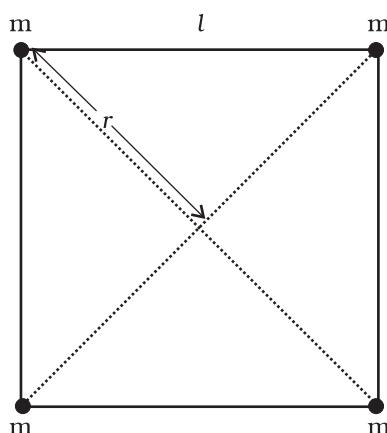

> **Figure Description (llava:latest):**
> The image appears to be a graph or diagram related to the gravitational force between two objects at different heights. The surrounding text discusses the potential energy and work done in lifting a particle from one height to another along a vertical path, with reference to Equation (7.24) provided by the text. The equation refers to the gravitational force formula, which includes the mass of an object, its distance from the center of the earth, and the gravitational constant G.
> 
> The diagram has several components:
> 
> 1. It shows two vertical lines, one with a label "r" and the other not labeled but also indicating different heights. The line "r" is associated with the potential energy equation provided by the text.
> 2. There are dots connecting the two lines, which likely represent points at different heights along a vertical path. These dots could represent data points or steps in the calculation of the potential energy and work done.
> 3. The surrounding text mentions "Example 7.3," which is related to a system of four particles placed at the vertices of a square. This might imply that the diagram represents a simplified model of such a system, but without additional context or visible data, it's difficult to provide further details about this aspect.
> 
> The image seems to be illustrating a concept from physics or engineering related to gravitational force and potential energy at different heights. The relationship between the components of the diagram (lines, dots) and the equations provided by the text is not clear without visualizing the document itself.

*Example 7.3* Find the potential energy of a system of four particles placed at the vertices of a square of side *l*. Also obtain the potential at the centre of the square.

$$W(r) = -\frac{G M_E m}{r} + W_1, \quad (7.25)$$

*r* valid for *r* > *R* ,

so that once again *W*12 = *W*(*r*2) – *W*(*r*1). Setting *r* = infinity in the last equation, we get W ( *r* = infinity ) = *W*1 . Thus, *W*1is the potential energy at infinity. One should note that only the difference of potential energy between two points has a definite meaning from Eqs. (7.22) and (7.24). One conventionally sets *W*1 equal to zero, so that the potential energy at a point is just the amount of work done in displacing the particle from infinity to that point.

We have calculated the potential energy at a point of a particle due to gravitational forces on it due to the earth and it is proportional to the mass of the particle. The gravitational potential due to the gravitational force of the earth is defined as the potential energy of a particle of unit mass at that point. From the earlier discussion, we learn that the gravitational potential energy associated with two particles of masses *m*1 and *m*2 separated by distance by a distance *r* is given by

$$V = - \frac{Gm_1 m_2}{r} \quad (\text{if we choose } V = 0 \text{ as } r \rightarrow \infty)$$

It should be noted that an isolated system of particles will have the total potential energy that equals the sum of energies (given by the above equation) for all possible pairs of its constituent particles. This is an example of the application of the superposition principle.

*Answer* Consider four masses each of mass m at the corners of a square of side *l*; See Fig. 7.9. We have four mass pairs at distance *l* and two

diagonal pairs at distance 2 *l*

Hence,

$$W(r) = -4 \frac{G m^2}{l} - 2 \frac{G m^2}{\sqrt{2} l}$$

$$= -\frac{2 G m^2}{l} \left( 2 + \frac{1}{\sqrt{2}} \right) = -5.41 \frac{G m^2}{l}$$

The gravitational potential at the centre of

the square 
$$(r = \sqrt{2} l/2)$$
 is

$$U(r) = - 4\sqrt{2} \frac{\text{G m}}{l}.$$

# 7.8 ESCAPE SPEED

If a stone is thrown by hand, we see it falls back to the earth. Of course using machines we can shoot an object with much greater speeds and with greater and greater initial speed, the object scales higher and higher heights. A natural query that arises in our mind is the following: 'can we throw an object with such high initial speeds that it does not fall back to the earth?'

The principle of conservation of energy helps us to answer this question. Suppose the object did reach infinity and that its speed there was V*f* . The energy of an object is the sum of potential and kinetic energy. As before *W*1 denotes that gravitational potential energy of the object at infinity. The total energy of the projectile at infinity then is

$$E() = W_1 + \frac{mV_f^2}{2} \quad (7.26)$$

If the object was thrown initially with a speed *Vi* from a point at a distance (*h*+*RE*) from the centre of the earth (*RE* = radius of the earth), its energy initially was

$$E(h + R_E) = \frac{1}{2} m V_i^2 - \frac{G m M_E}{(h + R_E)} + W_1 \quad (7.27)$$

*Fig. 7.9*

By the principle of energy conservation Eqs. (7.26) and (7.27) must be equal. Hence

$$\frac{mV_i^2}{2} - \frac{GmM_E}{(h + R_E)} = \frac{mV_f^2}{2} \quad (7.28)$$

The R.H.S. is a positive quantity with a minimum value zero hence so must be the L.H.S. Thus, an object can reach infinity as long as V*i* is such that

$$\frac{mV_i^2}{2} - \frac{GmM_E}{(h + R_E)} \geq 0 \quad (7.29)$$

The minimum value of V*i* corresponds to the case when the L.H.S. of Eq. (7.29) equals zero. Thus, the minimum speed required for an object to reach infinity (i.e. escape from the earth) corresponds to

$$\frac{1}{2} m (V_t^2)_{\min} = \frac{GmM_E}{h + R_E} \quad (7.30)$$

If the object is thrown from the surface of the earth, *h* = 0, and we get

$$(V_i)_{\min} = \sqrt{\frac{2GM_E}{R_E}} \quad (7.31)$$

Using the relation 2 *g GM R* = *EE* / , we get

$$(V_i)_{\min} = \sqrt{2gR_E} \quad (7.32)$$

Using the value of *g* and *RE*, numerically (*Vi* )min≈11.2 km/s. This is called the escape speed, sometimes loosely called the escape velocity.

Equation (7.32) applies equally well to an object thrown from the surface of the moon with *g* replaced by the acceleration due to Moon's gravity on its surface and *rE* replaced by the radius of the moon. Both are smaller than their values on earth and the escape speed for the moon turns out to be 2.3 km/s, about five times smaller. This is the reason that moon has no atmosphere. Gas molecules if formed on the surface of the moon having velocities larger than this will escape the gravitational pull of the moon.

*Example 7.4* Two uniform solid spheres of equal radii *R*, but mass *M* and 4 *M* have a centre to centre separation 6 *R*, as shown in Fig. 7.10. The two spheres are held fixed. A projectile of mass *m* is projected from the surface of the sphere of mass *M* directly towards the centre of the second sphere. Obtain an expression for the minimum speed v of the projectile so that it reaches the surface of the second sphere.

*Fig. 7.10*

*Answer* The projectile is acted upon by two mutually opposing gravitational forces of the two spheres. The neutral point N (see Fig. 7.10) is defined as the position where the two forces cancel each other exactly. If ON = *r*, we have

$$\frac{G M m}{r^2} = \frac{4 G M m}{(6R-r)^2}$$

$$(6R-r)^2 = 4r^2$$

$$6R - r = \pm 2r$$

$$r = 2R \quad \text{or} \quad -6R.$$

The neutral point *r =* – 6*R* does not concern us in this example. Thus ON *= r =* 2*R*. It is sufficient to project the particle with a speed which would enable it to reach N. Thereafter, the greater gravitational pull of 4*M* would suffice. The mechanical energy at the surface of *M* is

$$E_i = \frac{1}{2} m v^2 - \frac{G M m}{R} - \frac{4 G M m}{5 R}.$$

At the neutral point N, the speed approaches zero. The mechanical energy at N is purely potential.

$$E_N = -\frac{G M m}{2R} - \frac{4 G M m}{4R}.$$

From the principle of conservation of mechanical energy

| $\frac{1}{2}v^2 - \frac{GM}{R} - \frac{4GM}{5R} = -\frac{GM}{2R} - \frac{GM}{R}$ |
|----------------------------------------------------------------------------------|
|                                                                                  |

or

⊳ **Example 7.5** The planet Mars has two moons, phobos and delmos. (i) phobos has a period 7 hours, 39 minutes and an orbital radius of 9.4 ´103 km. Calculate the mass of mars. (ii) Assume that earth and mars move in circular orbits around the sun, with the martian orbit being 1.52 times the orbital radius of the earth. What is the length of the martian year in days ?

$$v^2 = \frac{2GM}{R} \left( \frac{4}{5} - \frac{1}{2} \right)$$

$$v = \left( \frac{3 G M}{5 R} \right)^{1/2}$$

A point to note is that the speed of the projectile is zero at N, but is nonzero when it strikes the heavier sphere 4 *M*. The calculation of this speed is left as an exercise to the students.

# **7.9 EARTH SATELLITES**

Earth satellites are objects which revolve around the earth. Their motion is very similar to the motion of planets around the Sun and hence Kepler's laws of planetary motion are equally applicable to them. In particular, their orbits around the earth are circular or elliptic. Moon is the only natural satellite of the earth with a near circular orbit with a time period of approximately 27.3 days which is also roughly equal to the rotational period of the moon about its own axis. Since, 1957, advances in technology have enabled many countries including India to launch artificial earth satellites for practical use in fields like telecommunication, geophysics and meteorology.

We will consider a satellite in a circular orbit of a distance (*RE* + *h*) from the centre of the earth, where *RE* = radius of the earth. If *m* is the mass of the satellite and *V* its speed, the centripetal force required for this orbit is

$$F(\text{centripetal}) = \frac{mV^2}{(R_E + h)} \quad (7.33)$$

directed towards the centre. This centripetal force is provided by the gravitational force, which is

$$F(\text{gravitation}) = \frac{G m M_E}{(R_E + h)^2} \quad (7.34)$$

where *ME* is the mass of the earth.

Equating R.H.S of Eqs. (7.33) and (7.34) and cancelling out *m*, we get

$$V^2 = \frac{G M_E}{(R_E + h)} \quad (7.35)$$

Thus *V* decreases as *h* increases. From equation (7.35),the speed *V* for *h* = 0 is

| $V^2$ | $(h = 0) = GM / R_E = gR_E$ | (7.36) |
|-------|-----------------------------|--------|
|-------|-----------------------------|--------|

where we have used the relation

$$g = GM / R_E^2 \cdot \text{In every orbit, the satellite}$$

traverses a distance 2p(*RE* + *h*) with speed *V*. Its time period *T* therefore is

$$T = \frac{2\pi(R_E + h)}{V} = \frac{2\pi(R_E + h)^{3/2}}{\sqrt{G M_E}} \quad (7.37)$$

*E* on substitution of value of *V* from Eq. (7.35). Squaring both sides of Eq. (7.37), we get

$$T^2 = k (r_E + h)^3$$
 (where  $k = 4 \pi^2 / G M_E$ ) (7.38)

which is Kepler's law of periods, as applied to motion of satellites around the earth. For a satellite very close to the surface of earth *h* can be neglected in comparison to *RE* in Eq. (7.38). Hence, for such satellites, *T* is *T*o , where

$$T_0 = 2\pi\sqrt{R_E/g} \quad (7.39)$$

If we substitute the numerical values g ≃ 9.8 m s-2 and *RE* = 6400 km., we get

$$T_0 = 2\pi\sqrt{\frac{6.4 \times 10^6}{9.8}} \text{ s}$$

Which is approximately 85 minutes.

**Answer** (i) We employ Eq. (7.38) with the Sun's mass replaced by the martian mass *Mm*

$$T^2 = \frac{4\pi^2}{GM_{\text{B}^2}} R^3$$

$$\begin{aligned} & 4 \times (3.14)^2 \times (9.4)^3 \times 10^{18} \\ &= \frac{6.67 \times 10^{-11} \times (459 \times 60)^2}{} \end{aligned}$$

$$M_m = \frac{4 \times (3.14)^2 \times (9.4)^3 \times 10^{18}}{6.67 \times (4.59 \times 6)^2 \times 10^{-5}} = 6.48 \times 10^{23} \text{ kg.}$$

(ii) Once again Kepler's third law comes to our aid,

$$\frac{T_M^2}{T_E^2} = \frac{R_{MS}^3}{R_{ES}^3}$$

⊳ **Example 7.7** Express the constant k of Eq. (7.38) in days and kilometres. Given k = 10–13 s2 m–3. The moon is at a distance of 3.84 ´ 105km from the earth. Obtain its time-period of revolution in days.

⊳ **Example 7.6 Weighing the Earth** : You are given the following data: *g =* 9.81 ms–2 , *RE =* 6.37´106 m, the distance to the moon *R =* 3.84´108 m and the time period of the moon's revolution is 27.3 days. Obtain the mass of the Earth *ME* in two different ways.

where *RMS* is the Mars-Sun distance and *RES* is the Earth-Sun distance.

$$\therefore T_M = (1.52)^{3/2} \times 365$$
  
 $= 684$  days

We note that the orbits of all planets except Mercury and Mars are very close to being circular. For example, the ratio of the semiminor to semi-major axis for our Earth is, *b/a* = 0.99986. ⊳

**Answer** From Eq. (7.12) we have

$$\begin{aligned} M_E &= \frac{g R_E^2}{G} \\ &= \frac{9.81 \times (6.37 \times 10^6)^2}{6.67 \times 10^{-11} \text{ kg} \cdot 5.97 \times 10^{24} \text{ kg}} \end{aligned}$$

The moon is a satellite of the Earth. From the derivation of Kepler's third law [see Eq. (7.38)]

$$\begin{aligned} T^2 &= \frac{4\pi^2 R^3}{G M_E} \\ M_E &= \frac{4\pi^2 R^3}{G T^2} \\ &= \frac{4 \times 3.14 \times 3.14 \times (3.84)^3 \times 10^{24}}{6.67 \times 10^{-11} \times (27.3 \times 24 \times 60 \times 60)^3} \\ &= 6.02 \times 10^{24} \text{ kg} \end{aligned}$$

$$T^2 = \frac{4\pi^2 R^3}{G M_E}$$

Both methods yield almost the same answer, the difference between them being less than 1%.

⊳

**Answer** Given 
$$k = 10^{-13} \text{ s}^2 \text{ m}^{-3}$$

$$\begin{aligned}
 &= 10^{-13} \left[ \frac{1}{(24 \times 60 \times 60)^2} d^2 \right] \left[ \frac{1}{(1/1000)^3 \text{ km}^3} \right] \\
 &= 1.33 \times 10^{-14} d^2 \text{ km}^{-3}
 \end{aligned}$$

Using Eq. (7.38) and the given value of k, the time period of the moon is

The period of the motor is 
$$T^2 = (1.33 \times 10^{-14})(3.84 \times 10^5)^3$$
  
 $T = 27.3 \text{ d}$ 

Note that Eq. (7.38) also holds for elliptical orbits if we replace (*RE*+*h*) by the semi-major axis of the ellipse. The earth will then be at one of the foci of this ellipse.

# **7.10 ENERGY OF AN ORBITING SATELLITE**

Using Eq. (7.35), the kinetic energy of the satellite in a circular orbit with speed *v* is

$$K \cdot E = \frac{1}{2} m v^2$$

$$= \frac{Gm M_E}{2(R_E + h)} \quad (7.40)$$

*E* Considering gravitational potential energy at infinity to be zero, the potential energy at distance (Re +h) from the centre of the earth is

$$P.E = -\frac{G m M_E}{(R_E + h)} \quad (7.41)$$

The K.E is positive whereas the P.E is negative. However, in magnitude the K.E. is half the P.E, so that the total E is

$$E = K.E + P.E = -\frac{GmM_E}{2(R_E+h)} \quad (7.42)$$

The total energy of an circularly orbiting satellite is thus negative, with the potential energy being negative but twice is magnitude of the positive kinetic energy.

When the orbit of a satellite becomes elliptic, both the *K.E.* and *P.E.* vary from point to point. The total energy which remains constant is negative as in the circular orbit case. This is what we expect, since as we have discussed before if the total energy is positive or zero, the object escapes to infinity. Satellites are always at finite distance from the earth and hence their energies cannot be positive or zero.

**Example 7.8** A 400 kg satellite is in a circular orbit of radius  $2R_E$  about the Earth. How much energy is required to transfer it to a circular orbit of radius  $4R_E$ ? What are the changes in the kinetic and potential energies?

**Answer** Initially,

$$E_i = -\frac{G M_E m}{4 R_E}$$

While finally

$$E_f = -\frac{G M_E m}{8 R_E}$$

The change in the total energy is

$$\Delta E = E_f - E_i$$

$$= \frac{G M_E m}{8 R_E} = \left( \frac{G M_E}{R_E^2} \right) \frac{m R_E}{8}$$

$$\Delta E = \frac{g m R_E}{8} = \frac{9.81 \times 400 \times 6.37 \times 10^6}{8} = 3.13 \times 10^9 \text{ J}$$

The kinetic energy is reduced and it mimics  $\Delta E$ , namely,  $\Delta K = K_f - K_i = -3.13 \times 10^9 \text{ J}$ .

The change in potential energy is twice the change in the total energy, namely

$$\Delta V = V_f - V_i = -6.25 \times 10^9 \text{ J}$$

## SUMMARY

1. 1. Newton's law of universal gravitation states that the gravitational force of attraction between any two particles of masses  $m_1$  and  $m_2$  separated by a distance  $r$  has the magnitude

$$F = G \frac{m_1 m_2}{r^2}$$

where  $G$  is the universal gravitational constant, which has the value  $6.672 \times 10^{-11} \text{ N m}^2 \text{ kg}^{-2}$ .

1. 2. If we have to find the resultant gravitational force acting on the particle  $m$  due to a number of masses  $M_1, M_2, \dots, M_n$  etc. we use the principle of superposition. Let  $F_1, F_2, \dots, F_n$  be the individual forces due to  $M_1, M_2, \dots, M_n$  each given by the law of gravitation. From the principle of superposition each force acts independently and uninfluenced by the other bodies. The resultant force  $F_R$  is then found by vector addition

$$F_R = F_1 + F_2 + \dots + F_n = \sum_{i=1}^n F_i$$

where the symbol ' $\Sigma$ ' stands for summation.

1. 3. Kepler's laws of planetary motion state that
   1. (a) All planets move in elliptical orbits with the Sun at one of the focal points
   2. (b) The radius vector drawn from the Sun to a planet sweeps out equal areas in equal time intervals. This follows from the fact that the force of gravitation on the planet is central and hence angular momentum is conserved.
   3. (c) The square of the orbital period of a planet is proportional to the cube of the semi-major axis of the elliptical orbit of the planet

The period  $T$  and radius  $R$  of the circular orbit of a planet about the Sun are related by

$$T^2 = \left( \frac{4\pi^2}{G M_s} \right) R^3$$

where  $M_s$  is the mass of the Sun. Most planets have nearly circular orbits about the Sun. For elliptical orbits, the above equation is valid if  $R$  is replaced by the semi-major axis,  $a$ .

1. 4. The acceleration due to gravity.
   1. (a) at a height  $h$  above the earth's surface

$$g(h) = \frac{G M_E}{(R_E + h)^2}$$

$$\approx \frac{G M_E}{R_E^2} \left( 1 - \frac{2h}{R_E} \right) \quad \text{for } h \ll R_E$$

$$g(h) = g(0) \left( 1 - \frac{2h}{R_E} \right) \quad \text{where } g(0) = \frac{G M_E}{R_E^2}$$

(b) at depth  $d$  below the earth's surface is

$$g(d) = \frac{G M_E}{R_E^2} \left( 1 - \frac{d}{R_E} \right) = g(0) \left( 1 - \frac{d}{R_E} \right)$$

5. The gravitational force is a conservative force, and therefore a potential energy function can be defined. The *gravitational potential energy* associated with two particles separated by a distance  $r$  is given by

$$V = -\frac{G m_1 m_2}{r}$$

where  $V$  is taken to be zero at  $r \rightarrow \infty$ . The total potential energy for a system of particles is the sum of energies for all pairs of particles, with each pair represented by a term of the form given by above equation. This prescription follows from the principle of superposition.

6. If an isolated system consists of a particle of mass  $m$  moving with a speed  $v$  in the vicinity of a massive body of mass  $M$ , the total mechanical energy of the particle is given by

$$E = \frac{1}{2} m v^2 - \frac{G M m}{r}$$

That is, the total mechanical energy is the sum of the kinetic and potential energies. The total energy is a constant of motion.

7. If  $m$  moves in a circular orbit of radius  $a$  about  $M$ , where  $M \gg m$ , the total energy of the system is

$$E = -\frac{G M m}{2a}$$

with the choice of the arbitrary constant in the potential energy given in the point 5., above. The total energy is negative for any bound system, that is, one in which the orbit is closed, such as an elliptical orbit. The kinetic and potential energies are

$$K = \frac{G M m}{2a}$$

$$V = -\frac{G M m}{a}$$

8. The escape speed from the surface of the earth is

$$v_e = \sqrt{\frac{2 G M_E}{R_E}} = \sqrt{2 g R_E}$$

and has a value of  $11.2 \text{ km s}^{-1}$ .

9. If a particle is outside a uniform spherical shell or solid sphere with a spherically symmetric internal mass distribution, the sphere attracts the particle as though the mass of the sphere or shell were concentrated at the centre of the sphere.

10. If a particle is inside a uniform spherical shell, the gravitational force on the particle is zero. If a particle is inside a homogeneous solid sphere, the force on the particle acts toward the centre of the sphere. This force is exerted by the spherical mass interior to the particle.

| Physical Quantity              | Symbol                       | Dimensions                                 | Unit                          | Remarks                              |
|--------------------------------|------------------------------|--------------------------------------------|-------------------------------|--------------------------------------|
| Gravitational Constant         | $G$                          | $[\text{M}^{-1} \text{L}^3 \text{T}^{-2}]$ | $\text{N m}^2 \text{kg}^{-2}$ | $6.67 \times 10^{-11}$               |
| Gravitational Potential Energy | $V(r)$                       | $[\text{M L}^2 \text{T}^{-2}]$             | $\text{J}$                    | $-\frac{GMm}{r}$ (scalar)         |
| Gravitational Potential        | $U(r)$                       | $[\text{L}^2 \text{T}^{-2}]$               | $\text{J kg}^{-1}$            | $-\frac{GM}{r}$ (scalar)          |
| Gravitational Intensity        | $\mathbf{E}$ or $\mathbf{g}$ | $[\text{LT}^{-2}]$                         | $\text{m s}^{-2}$             | $\frac{GM}{r^2} \hat{r}$ (vector) |

### POINTS TO PONDER

- 1. In considering motion of an object under the gravitational influence of another object the following quantities are conserved:
  - (a) Angular momentum
  - (b) Total mechanical energy Linear momentum is not conserved
- 2. Angular momentum conservation leads to Kepler's second law. However, it is not special to the inverse square law of gravitation. It holds for any central force.
- 3. In Kepler's third law (see Eq. (7.1) and *T2 = KS R3*. The constant *KS* is the same for all planets in circular orbits. This applies to satellites orbiting the Earth [(Eq. (7.38)].
- 4. An astronaut experiences weightlessness in a space satellite. This is not because the gravitational force is small at that location in space. It is because both the astronaut and the satellite are in "free fall" towards the Earth.
- 5. The *gravitational potential energy* associated with two particles separated by a distance *r* is given by

$$V = -\frac{Gm_1 m_2}{r} + \text{constant}$$

The constant can be given any value. The simplest choice is to take it to be zero. With this choice

$$V = - \frac{G m_1 m_2}{r}$$

This choice implies that *V* → 0 as *r* → . Choosing location of zero of the gravitational energy is the same as choosing the arbitrary constant in the potential energy. Note that

- the gravitational force is not altered by the choice of this constant.
- 6. The total mechanical energy of an object is the sum of its kinetic energy (which is always positive) and the potential energy. Relative to infinity (i.e. if we presume that the potential energy of the object at infinity is zero), the gravitational potential energy of an object is negative. The total energy of a satellite is negative.
- 7. The commonly encountered expression *mgh* for the potential energy is actually an approximation to the difference in the gravitational potential energy discussed in the point 6, above.
- 8. Although the gravitational force between two particles is central, the force between two finite rigid bodies is not necessarily along the line joining their centre of mass. For a spherically symmetric body however the force on a particle external to the body is as if the mass is concentrated at the centre and this force is therefore central.
- 9. The gravitational force on a particle inside a spherical shell is zero. However, (unlike a metallic shell which shields electrical forces) the shell does not shield other bodies outside it from exerting gravitational forces on a particle inside. *Gravitational shielding is not possible*.

# EXERCISES

- 7.1 Answer the following :
  - (a) You can shield a charge from electrical forces by putting it inside a hollow conductor. Can you shield a body from the gravitational influence of nearby matter by putting it inside a hollow sphere or by some other means ?
  - (b) An astronaut inside a small space ship orbiting around the earth cannot detect gravity. If the space station orbiting around the earth has a large size, can he hope to detect gravity ?
  - (c) If you compare the gravitational force on the earth due to the sun to that due to the moon, you would find that the Sun's pull is greater than the moon's pull. (you can check this yourself using the data available in the succeeding exercises). However, the tidal effect of the moon's pull is greater than the tidal effect of sun. Why ?
7.2 Choose the correct alternative :

- (a) Acceleration due to gravity increases/decreases with increasing altitude.
- (b) Acceleration due to gravity increases/decreases with increasing depth (assume the earth to be a sphere of uniform density).
- (c) Acceleration due to gravity is independent of mass of the earth/mass of the body.
- (d) The formula  $-G Mm(1/r_2 - 1/r_1)$  is more/less accurate than the formula  $mg(r_2 - r_1)$  for the difference of potential energy between two points  $r_2$  and  $r_1$  distance away from the centre of the earth.

7.3 Suppose there existed a planet that went around the Sun twice as fast as the earth. What would be its orbital size as compared to that of the earth ?

7.4 Io, one of the satellites of Jupiter, has an orbital period of 1.769 days and the radius of the orbit is  $4.22 \times 10^8$  m. Show that the mass of Jupiter is about one-thousandth that of the sun.

7.5 Let us assume that our galaxy consists of  $2.5 \times 10^{11}$  stars each of one solar mass. How long will a star at a distance of 50,000 ly from the galactic centre take to complete one revolution ? Take the diameter of the Milky Way to be  $10^5$  ly.

7.6 Choose the correct alternative:

- (a) If the zero of potential energy is at infinity, the total energy of an orbiting satellite is negative of its kinetic/potential energy.
- (b) The energy required to launch an orbiting satellite out of earth's gravitational influence is more/less than the energy required to project a stationary object at the same height (as the satellite) out of earth's influence.

7.7 Does the escape speed of a body from the earth depend on (a) the mass of the body, (b) the location from where it is projected, (c) the direction of projection, (d) the height of the location from where the body is launched?

7.8 A comet orbits the sun in a highly elliptical orbit. Does the comet have a constant (a) linear speed, (b) angular speed, (c) angular momentum, (d) kinetic energy, (e) potential energy, (f) total energy throughout its orbit? Neglect any mass loss of the comet when it comes very close to the Sun.

7.9 Which of the following symptoms is likely to afflict an astronaut in space (a) swollen feet, (b) swollen face, (c) headache, (d) orientational problem.

7.10 In the following two exercises, choose the correct answer from among the given ones: The gravitational intensity at the centre of a hemispherical shell of uniform mass density has the direction indicated by the arrow (see Fig 7.11) (i) a, (ii) b, (iii) c, (iv) 0.

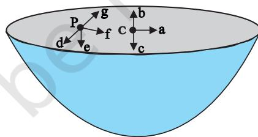

> **Figure Description (llava:latest):**
> The image shows a black-and-white illustration of an ice bucket containing a comet with a trail behind it. The comet is depicted with several labeled parts: 'F', 'P', 'C', 'E', and 'G'. There are also some numbers next to the comet: 6, 4, 2, 1, which could represent the magnitude or distance of the comet from various points in the diagram.
> 
> The surrounding text discusses mass loss of a comet near the Sun, symptoms for an astronaut in space, and exercises regarding gravitational intensity at the center of a hemispherical shell of uniform mass density. There are four multiple-choice questions related to gravitational force: (a) d, (b) e, (c) f, (d) g.
> 
> The diagram is likely meant to represent the shape and path of a comet, but it's not clear from the image alone how this relates to the mass loss or gravitational intensity questions. The numbers next to the comet might indicate distances from different parts of the diagram or stages of disintegration, which could be relevant to both topics.
> 
> Without the ability to see the actual image, it's challenging to provide a detailed description. However, the text suggests that the comet is being discussed in the context of its path near the Sun and potentially the gravitational force acting upon an ice bucket with the comet inside.

Fig. 7.117.11 For the above problem, the direction of the gravitational intensity at an arbitrary point P is indicated by the arrow (i) d, (ii) e, (iii) f, (iv) g.

7.12 A rocket is fired from the earth towards the sun. At what distance from the earth's centre is the gravitational force on the rocket zero ? Mass of the sun =  $2 \times 10^{30}$  kg, mass of the earth =  $6 \times 10^{24}$  kg. Neglect the effect of other planets etc. (orbital radius =  $1.5 \times 10^{11}$  m).

7.13 How will you 'weigh the sun', that is estimate its mass? The mean orbital radius of the earth around the sun is  $1.5 \times 10^8$  km.

7.14 A saturn year is 29.5 times the earth year. How far is the saturn from the sun if the earth is  $1.50 \times 10^8$  km away from the sun ?

7.15 A body weighs 63 N on the surface of the earth. What is the gravitational force on it due to the earth at a height equal to half the radius of the earth ?

7.16 Assuming the earth to be a sphere of uniform mass density, how much would a body weigh half way down to the centre of the earth if it weighed 250 N on the surface ? 7.17 A rocket is fired vertically with a speed of 5 km s-1 from the earth's surface. How far from the earth does the rocket go before returning to the earth ? Mass of the earth = 6.0 × 1024 kg; mean radius of the earth = 6.4 × 106 m; *G* = 6.67 × 10–11 N m2 kg*–*2 . 7.18 The escape speed of a projectile on the earth's surface is 11.2 km s–1. A body is projected out with thrice this speed. What is the speed of the body far away from the earth? Ignore the presence of the sun and other planets. 7.19 A satellite orbits the earth at a height of 400 km above the surface. How much energy must be expended to rocket the satellite out of the earth's gravitational influence? Mass of the satellite = 200 kg; mass of the earth = 6.0×1024 kg; radius of the earth = 6.4 × 106 m; *G* = 6.67 × 10–11 N m2 kg*–*2 . 7.20 Two stars each of one solar mass (= 2×1030 kg) are approaching each other for a head on collision. When they are a distance 109 km, their speeds are negligible. What is the speed with which they collide ? The radius of each star is 104 km. Assume the stars to remain undistorted until they collide. (Use the known value of *G*). 7.21 Two heavy spheres each of mass 100 kg and radius 0.10 m are placed 1.0 m apart on a horizontal table. What is the gravitational force and potential at the mid point of the line joining the centres of the spheres ? Is an object placed at that point in equilibrium? If so, is the equilibrium stable or unstable ?